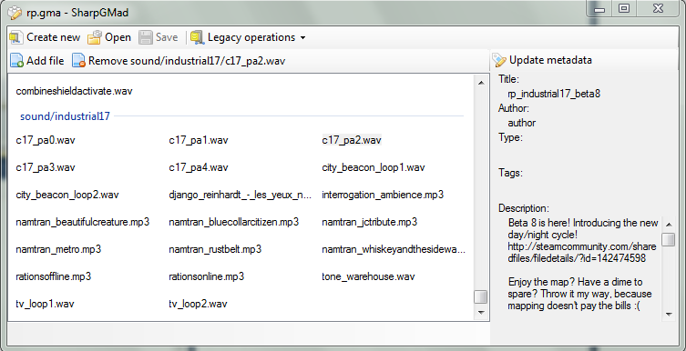

SharpGMad
=========

SharpGMad is a reimplementation of Garry Newman's 
[GMad](http://github.com/garrynewman/gmad) application.

_GMad_ is used to manipulate Garry's Mod (his game) addon files and is
written in C++. SharpGMod takes it to be in C#, originally written directly
from the code available by garry.

(The current version of SharpGMad implements and complies with
[`8b1c7b9011`](http://github.com/garrynewman/gmad/tree/8b1c7b9011d81ef0f7378eae482a6a94a6536b0e).)

Ever since, SharpGMad's code has been refurbished to match more with
development style used in C# applications, and to, of course, support new
opportunities.

Usage
-----

Currently three operation modes are supported:

### [`gmad`](http://github.com/garrynewman/gmad) (legacy) mode

This code is a straight mirror-implementation, so the command interface is the
same.

`SharpGMad.exe <command> <options>`

To create a new .gma file

`SharpGMad.exe create -folder "C:\path\to\addon\folder\" -out
"C:\where\to\save\file\out.gma"`

To extract an existing .gma file into its parent folder

`SharpGMad.exe extract -file
"C:\steam\etc\garrysmod\addons\my_addon_12345.gma"`

To extract an existing .gma file into another folder

`SharpGMad.exe extract -file "C:\steam\etc\garrysmod\addons\my_addon_12345.gma"
-out "C:\this\folder"`

### Realtime access

What is the main feature of SharpGMad, however, is the so-called realtime
wrapper. With it, you can load a GMA file like any other archive (zip,
rar, tar, ...) and update the contents of the files in it without having
to fully extract and then repack the file.

The realtime wrapper comes in two flavours.

#### GUI

`SharpGMad.exe [path]`

If the program is started with no command-line arguments (or the only
argument is a file path), a GUI will load. (Because of this, dragging and
dropping a file onto SharpGMad in Explorer is supported.)

The GUI supports all the functionality you can have by using the realtime
console, only with an added, neat graphical interface.

#### Console

`SharpGMad.exe realtime`

Optionally, you can specify a .gma file to be loaded initially

`SharpGMad.exe realtime -file "C:\steam\etc\garrysmod\addons\my_addon_12345.gma"`

Once running, the following commands will be available to you

    load <filename>          Loads <filename> addon into the memory
    new <filename>           Creates a new, empty addon named <filename>
    add <filename>           Adds <filename> to the archive
    addfolder <folder>       Adds all files from <folder> to the archive
    list                     Lists the files in the memory
    remove <filename>        Removes <filename> from the archive
    push                     Writes the addon to the disk
    close                    Writes the addon and closes it
    abort                    Unloads the addon from memory, dropping all changes
    path                     Prints the full path of the current addon
    pwd                      Prints SharpGMad's current working directory
    cd <folder>              Changes the current working directory to <folder>
    help                     Show the list of available commands
    exit                     Exits

Compiling and requirements
--------------------------

SharpGMad is written for the .NET 4.0 framework. This is the only
requirement, you can compile the solution with any development environment
on any computer compatible with .NET 4.0.
